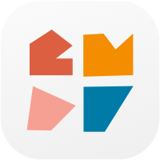
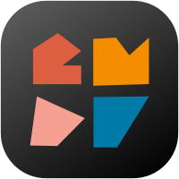

# 🏕 Campare

<div align="center">

<a href="https://github.com#gh-light-mode-only">
  
</a>

<a href="https://github.com#gh-dark-mode-only">
    
</a>
  
<br>
<br>

📆 2022. 05. 10. ~ 2022. 06. 20.

[](https://developer.apple.com/kr/swift/) [](https://developer.apple.com/kr/xcode/)

[📝 Backlog 🔗](https://docs.google.com/spreadsheets/d/1PN3syMmdZ4WZj2gnUC8ggnf9xVL-oy1SO3Nf8fSVbqE/edit#gid=0)

</div>

## 🧑🏻‍💻👩🏻‍💻 Members

|||||||
|:-:|:-:|:-:|:-:|:-:|:-:|
|[Berry](https://github.com/vveryberry)|[Goban](https://github.com/Gobans)|[Maeve](https://github.com/mijinc)|[Jin](https://github.com/jinwp)|[River](https://github.com/rriver2)|[Smile](https://github.com/sustainable-git)|
|UI Designer|iOS Developer|UX Designer|iOS Developer|iOS Developer|iOS Developer|

<br>

## 🎯 Project Goal

- Create a great user experience through campare app.
    - Improving the car camping experience that has increased to the new normal after Covid hits in Korea
    - Reducing time exploring, searching, sorting camping equipments before starting camping 

<br>

## Project Structure

```swift
Project
    ㄴ Application
        ㄴ App.swift
        ㄴ Info.plist
        ㄴ Assets.xcaseets
        ㄴ Preview Content
    ㄴ Utility
        ㄴ ColorExtension.swift
    ㄴ View
    ㄴ ViewModel
    ㄴ UseCase
    ㄴ Model
    ㄴ Entity
    ㄴ Repository
    ㄴ Service
```


<br>

## 🛠 Developement Environment

|Environment|Version|
|:-:|:-:|
|Swift|5.6|
|Xcode|13.4.1|
|iOS Deployment Target|14.0|
|CocoaPods|1.11.3|

<br>

## 🐈‍⬛ Git

### Git branching Strategy

- Upstream(This repository)
  - Origin(Porked repository)
    - Local(Individual desktop)

- Branches
  - Main
  - dev
  - feature
  - bug

- Method
    - Create Origin by forking Upstream
    - Clone only dev branch from Origin to Local
    - Create a feature branch in the local dev branch
    - Working on a feature branch
    - Push from the Local feature branch to the Origin feature branch
    - Send a pull request from the feature branch of Origin to the dev branch of Upstream
        - If a complict occurs, modify the feature branch of the Origin
    - Rebase and merge in the Upstream dev branch
    - Fetch upstream dev branch from Local dev branch
    - Rebase the contents fetched from the Local dev branch
    - Delete the feature branch of Origin from Local

### Commit Convention

- ex) [Feature] #10 : Add Category UI

|Tag|For|
|:-:|:-:|
|[Feature]|Develope feature|
|[Bug]|Fix bug|
|[Refactor]|Code refactoring|
|[Project]|Project changes|
|[Documentation]|Modify documentation|
|[Test]|Test code|

### Merge Rule

- Merge Rule
    - KakaoTalk contact
        - When you upload a pull request, the person who uploaded it
        - After the review, the reviewer
        - The person who uploaded it when merging
        - If there is an error, the person who checked
    - Designated reviewer
        - It is difficult for everyone to review
        - Assigned review to relevant people and Smile
    - Who merges
        - After review approval, the person who posted the pull request do rebase and merge
    - Who builds and checks for errors
        - The person who posted the pull request checks the errors

### gitignore

- .DS_Store
- xcuserdata/
- Pods/

### gitattributes

- *.pbxproj binary merge=union

<br>

## 🔒 License

- [MIT License](./LICENSE)
